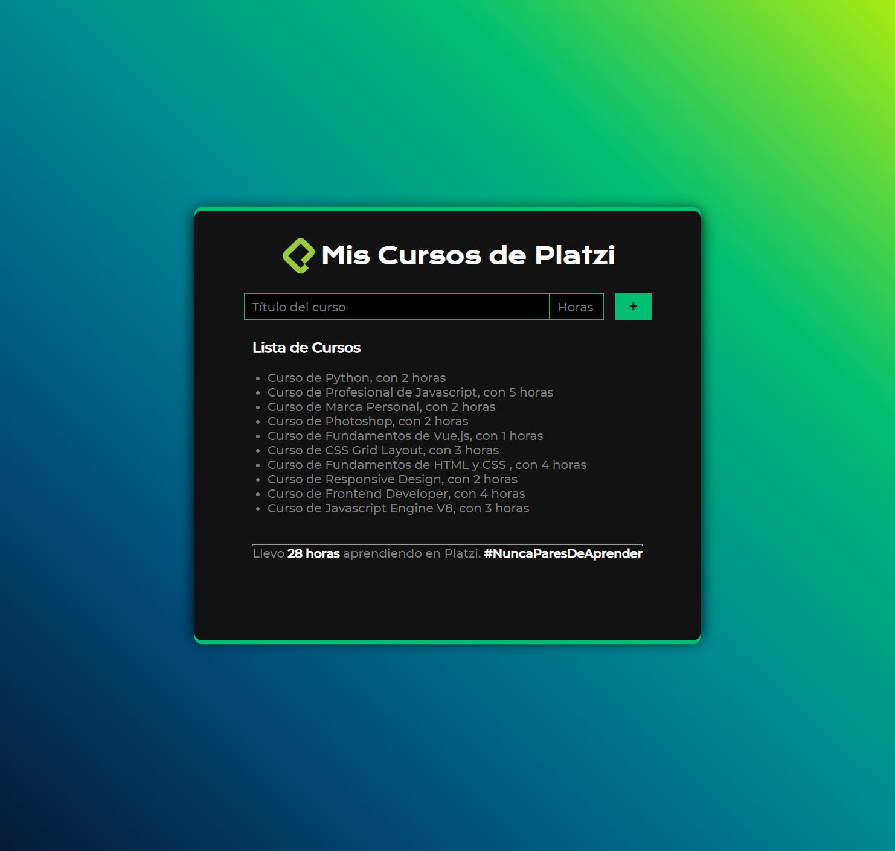

# Reto-01 del Curso Básico de Vue.js
El reto consistia en crear un array que permitiera almacenar la lista de cursos y su duración, finalmente desplegar la lista y realizar el conteo total de las horas invertidas en los cursos.

**Link** https://daniektj.github.io/Reto-01-Curso-Basico-de-Vue.js/

## Características
* Se uso **V-MODEL V-ON y V-FOR** 

## Resultado y enlace directo.

